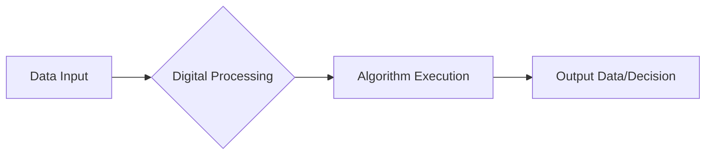
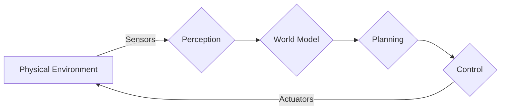

# What is Physical AI?

## Introduction to Physical AI

Physical AI refers to artificial intelligence systems that are embodied in physical forms, allowing them to interact directly with the real world through sensors and actuators. Unlike purely digital AI, which operates in simulated environments or processes abstract data, Physical AI systems gather data from their physical surroundings, make decisions based on this sensory input, and execute actions that have tangible effects on the environment. This direct engagement with the physical world introduces a unique set of challenges and opportunities, requiring capabilities such as real-time perception, robust control, and adaptation to unpredictable physical phenomena.

## Digital AI vs. Physical AI

The distinction between digital and physical AI is crucial for understanding the scope and implications of each. While both aim to achieve intelligent behavior, their operational domains and fundamental challenges differ significantly. Digital AI often excels in tasks such as data analysis, natural language processing, game playing, and abstract problem-solving, where the environment can be perfectly modeled or is inherently digital. Physical AI, on the other hand, operates in unstructured, dynamic, and often uncertain physical environments, demanding a different set of intelligences.

Here's a comparison:

| Feature             | Digital AI                                     | Physical AI                                        |
| :------------------ | :--------------------------------------------- | :------------------------------------------------- |
| **Environment**     | Virtual, simulated, or data-driven             | Real world, unstructured, dynamic                  |
| **Interaction**     | Indirect (via interfaces, data streams)        | Direct (via sensors and actuators)                 |
| **Key Challenges**  | Data volume, computational complexity, bias    | Perception, control, dexterity, safety, real-time  |
| **Primary Goal**    | Information processing, pattern recognition    | Embodied action, physical manipulation             |
| **Examples**        | ChatGPT, AlphaGo, Recommendation Engines       | Humanoid robots, autonomous vehicles, industrial robots |

## Conceptual Diagrams

### Digital AI Conceptual Flow

### Physical AI Conceptual Flow

In the physical AI flow, the loop represents continuous interaction: sensors gather data, perception processes it, a world model is updated, planning generates actions, control executes them, and actuators affect the physical environment, which in turn feeds back into the sensors. This closed-loop interaction is fundamental to embodied intelligence.
