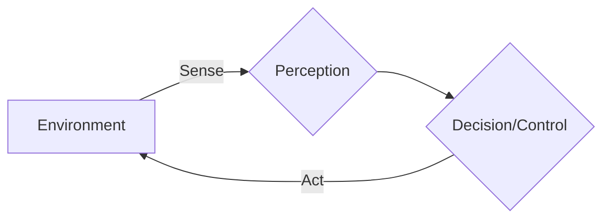

# Sensorimotor Intelligence

## Explanation of Sensorimotor Intelligence

Sensorimotor intelligence is the ability of an agent to acquire knowledge and interact with its environment through sensory inputs and motor actions. It's a fundamental form of intelligence, often considered the bedrock upon which more complex cognitive functions are built. In robotics, this involves the continuous loop of perceiving the environment (sensing), processing that information, making decisions, and executing physical movements (motor actions) that in turn affect subsequent perceptions. This iterative process allows robots to learn about their own body, the properties of objects, and the dynamics of the physical world through direct experience rather than pre-programmed knowledge alone.

## SensorAction Loops in Robotics

The core of sensorimotor intelligence in robotics lies in the design and implementation of efficient sensoraction loops. These loops are continuous feedback systems where sensory data (from cameras, touch sensors, IMUs, etc.) informs the robot's internal state and guides its motor commands. The executed actions then change the environment, which is again sensed, closing the loop. This dynamic interaction enables robots to perform tasks such as grasping objects, maintaining balance, and navigating complex terrains. The efficiency and robustness of these loops are critical for responsive and adaptive robotic behavior, allowing them to handle uncertainties and variations in real-world scenarios.

### Diagram: Basic SensorAction Loop

## Examples from Humanoids

Modern humanoids demonstrate advanced sensorimotor intelligence through a variety of tasks:

*   **Walking and Balance**: Humanoid robots use a combination of IMUs (Inertial Measurement Units) to sense their orientation and acceleration, and force-torque sensors in their feet to detect ground contact and pressure distribution. This sensory data feeds into complex control algorithms that adjust joint torques to maintain balance and execute dynamic walking gaits, adapting to uneven surfaces or external perturbations.

*   **Object Manipulation**: When a humanoid robot grasps an object, it uses cameras for visual perception to identify the object's shape, size, and position. Tactile sensors on its fingertips provide feedback on contact pressure and slip. This information is integrated to adjust grip force and wrist orientation, allowing for delicate manipulation of various objects, from a soft drink can to a heavy tool.

*   **Human-Robot Interaction**: During collaborative tasks, humanoids often use cameras and microphones to perceive human gestures, facial expressions, and vocal commands. Their sensorimotor intelligence allows them to interpret these cues and respond with appropriate actions, such as handing over a tool or adjusting their position to avoid collision, creating a more natural and intuitive interaction experience.

These examples highlight how sensorimotor intelligence is not just about isolated sensing or acting but the intelligent, coordinated interplay between the two.
