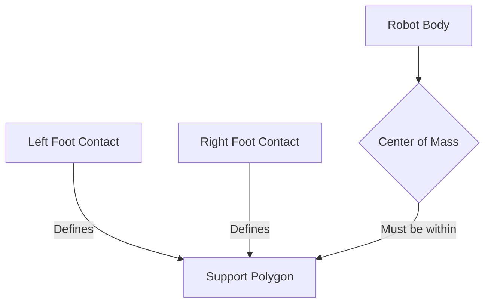

import ChapterCustomization from '@site/src/components/ChapterCustomization/ChapterCustomization';

<ChapterCustomization>

# Physics-Aware Reasoning

## Why Dexterity & Balance Require Physics Reasoning

For physical AI systems, particularly humanoids, achieving true dexterity and stable balance in the real world is impossible without a deep understanding and application of physics. Every interaction walking, grasping, pushing, lifting is governed by physical laws. Robots must be able to reason about forces, torques, momentum, and contact dynamics to predict how their actions will affect the environment and how the environment will, in turn, affect them. Without physics-aware reasoning, a robot might try to lift an object too heavy for its grip, walk on an unstable surface, or apply force in a way that causes it to lose balance. This reasoning allows robots to execute precise manipulations, maintain stability on varied terrains, and safely interact with their surroundings.

## Key Physics Concepts & Diagrams

Several fundamental physics concepts are critical for embodied AI:

*   **Friction**: The force resisting relative motion of solid surfaces, fluid layers, and material elements sliding against each other. Robots must understand friction to prevent slipping when walking or to securely grasp objects.

*   **Center of Mass (CoM)**: The unique point where the weighted relative position of the distributed mass sums to zero. Maintaining the CoM within the support polygon (the area defined by the robot's contact points with the ground) is essential for balance.

*   **Balance**: The ability to maintain equilibrium. For humanoids, this often involves dynamic balance, where the robot continuously adjusts its CoM to counteract gravitational forces and external perturbations.

*   **Inertia**: The resistance of any physical object to any change in its state of motion, including changes to its speed, direction, or state of rest. Robots must account for inertia when accelerating or decelerating their limbs to avoid overshooting or instability.

*   **Torque**: The rotational equivalent of linear force. It describes the effectiveness of a force in rotating an object around an axis. Accurate control of joint torques is paramount for precise and powerful movements.

### Diagram: Center of Mass and Support Polygon



### Diagram: Torque Application

```mermaid
graph LR
    A[Axis of Rotation] -- Lever Arm (r) --> B[Point of Force Application]
    F[Force (F)] -- Perpendicular to r --> B
    A -- Causes --> T[Torque (� = r x F)]
```

## Real vs. Simulated Physics

While physics engines in simulations (e.g., Isaac Gym, MuJoCo) are invaluable for training and testing AI policies, the transition from simulation to the real world (sim-to-real gap) remains a significant challenge. Simulated physics, though highly advanced, can never perfectly capture all the complexities, nonlinearities, and unforeseen dynamics of the real physical environment. Factors like material properties, sensor noise, actuator imperfections, and subtle environmental variations are often simplified or omitted in simulations. Robust physics-aware reasoning in real-world robots requires algorithms that can adapt to these discrepancies, learning from real-world interactions and continuously refining their internal physical models.

This adaptation often involves techniques such as real-time system identification, robust control methods, and learning algorithms that can transfer knowledge gained in simulation to practical applications with minimal re-training.

</ChapterCustomization>