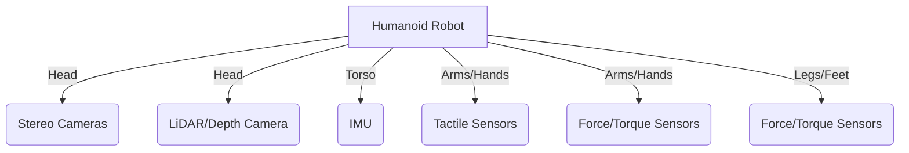

# Humanoid Sensors

## Array of Sensors Used by Humanoids

Humanoid robots rely on a sophisticated array of sensors to perceive their complex environment, understand their own state, and interact safely and effectively. These sensors provide the raw data that fuels the robot's perception, planning, and control systems, enabling capabilities from basic navigation to intricate manipulation. The selection and integration of these sensors are critical design choices, impacting the robot's autonomy, robustness, and ability to perform diverse tasks in unstructured settings.

Key sensor categories include:

*   **Vision-based sensors**: Cameras (monocular, stereo, depth) for object recognition, scene understanding, navigation.
*   **Proprioceptive sensors**: IMUs (Inertial Measurement Units) for orientation and acceleration, encoders for joint positions, force/torque sensors for interaction forces.
*   **Proximity sensors**: LiDAR, ultrasonic sensors for distance measurement and obstacle avoidance.
*   **Tactile sensors**: For detecting contact, pressure, and texture during manipulation.
*   **Auditory sensors**: Microphones for sound localization and speech recognition.

## Common Humanoid Sensors and Their Functions

| Sensor Type       | Function                                            | Examples in Humanoids                               |
| :---------------- | :-------------------------------------------------- | :-------------------------------------------------- |
| **Cameras**       | Visual perception, object detection, localization   | Head-mounted stereo cameras, depth cameras (e.g., Intel RealSense) |
| **IMU (Inertial Measurement Unit)** | Orientation, angular velocity, linear acceleration, balance | Embedded in torso, limbs, and head for stability control |
| **LiDAR (Light Detection and Ranging)** | 3D mapping, obstacle detection, navigation        | Often used for environmental mapping and collision avoidance |
| **Tactile Sensors** | Detect contact, pressure, slip, texture during grasp | Finger tips, palm, feet for fine manipulation and walking feedback |
| **Force/Torque (F/T) Sensors** | Measure interaction forces at joints or end-effectors | Wrists, ankles, or feet for compliant control and safe interaction |

## Comparison of Sensor Capabilities

Each sensor type offers unique advantages and often complements others. For example, cameras provide rich visual information but can be affected by lighting conditions, while LiDAR offers accurate depth data regardless of illumination but lacks color information. IMUs provide continuous state estimation but drift over time, requiring fusion with other sensors like cameras for drift correction.

### Diagram: Humanoid Sensor Placement Layout

This integrated sensor suite allows humanoids to build a comprehensive understanding of their internal state and external environment, enabling them to perform complex tasks in dynamic, real-world settings.
