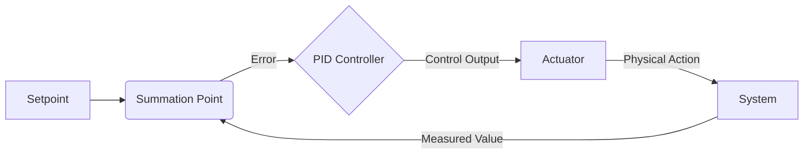
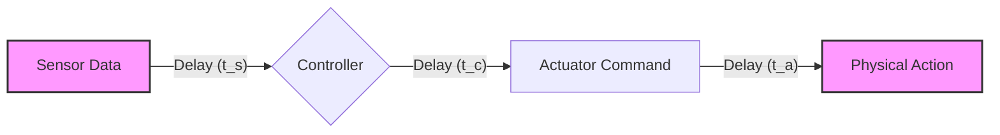

import ChapterCustomization from '@site/src/components/ChapterCustomization/ChapterCustomization';

<ChapterCustomization>

# Robotic Control Loops

## PID Control and Feedback Loops

At the heart of almost all robotic systems are control loops, mechanisms that enable robots to execute precise movements and maintain desired states. Among the most common and fundamental is the **PID (Proportional-Integral-Derivative) controller**. A PID controller continuously calculates an "error" value as the difference between a desired setpoint and a measured process variable. It then applies a correction based on three terms:

*   **Proportional (P)**: Corrects the error proportionally to its current magnitude. A larger error leads to a larger corrective action.
*   **Integral (I)**: Addresses accumulated past errors, helping to eliminate steady-state errors over time.
*   **Derivative (D)**: Anticipates future errors based on the rate of change of the current error, providing damping and preventing overshoot.

This feedback mechanism is crucial for dynamic stability and precise trajectory tracking. The outputs of PID controllers often drive low-level actuators, such as motor torques or joint velocities, to achieve the desired physical configuration.

### Diagram: PID Control Loop

## State Estimation and Low-Level Control

Robots operate within a broader control architecture that integrates state estimation with low-level control. **State estimation** is the process of inferring the robot's current condition (e.g., position, velocity, orientation of all joints and the base) from noisy sensor data. Techniques like Kalman filters or Extended Kalman Filters (EKF) are commonly used to fuse data from multiple sensors (IMUs, encoders, cameras) to provide a more accurate and robust estimate of the robot's state than any single sensor could provide.

**Low-level control** takes these estimated states and desired commands from higher-level planning systems to generate precise actuator commands (e.g., motor currents, joint torques). This layer operates at high frequencies to ensure rapid response and stability, often employing techniques like impedance control or admittance control to manage interaction forces with the environment.

## Latency Considerations in Robotic Control

Latency, the delay between a sensor reading and the corresponding actuator response, is a critical factor in robotic control. High latency can lead to instability, reduced precision, and even catastrophic failures, especially in dynamic tasks like walking or high-speed manipulation. Robotic control systems are meticulously designed to minimize latency through:

*   **High-frequency sensing and actuation**: Using sensors and motors capable of rapid data acquisition and response.
*   **Optimized communication**: Low-latency communication protocols and hardware to transmit data between sensors, controllers, and actuators.
*   **Real-time operating systems (RTOS)**: Ensuring predictable timing and deterministic execution of control algorithms.
*   **Predictive control**: Algorithms that anticipate future states to compensate for inherent system delays.

Managing latency is paramount for achieving the agility, responsiveness, and safety required for humanoids to operate effectively in complex environments.

### Diagram: Latency in Control Loop

Each stage introduces a delay (ts, tc, ta), which must be accounted for to maintain stable and effective control.

</ChapterCustomization>