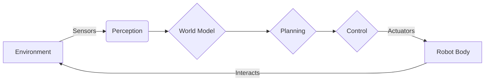
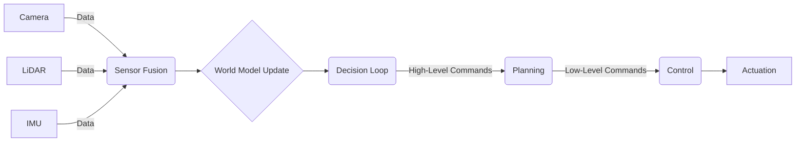

import ChapterCustomization from '@site/src/components/ChapterCustomization/ChapterCustomization';

<ChapterCustomization>

# Perception-Planning-Action Loop

## The Fundamental Cycle of Embodied AI

At the core of any intelligent embodied system, especially humanoids, lies the Perception-Planning-Action (PPA) loop. This fundamental cycle describes how a robot continuously interacts with its environment to achieve its goals. It's a generalization of the sensorimotor loop, encompassing higher-level cognitive functions. The PPA loop is not strictly sequential; instead, it involves continuous feedback and parallel processing across its stages, allowing robots to operate adaptively in dynamic and unpredictable real-world scenarios.

Each stage plays a critical role:

*   **Perception**: Gathering and interpreting sensory data from the environment (e.g., visual, auditory, tactile, proprioceptive). This involves raw data acquisition, filtering, feature extraction, and object recognition.
*   **World Modeling**: Building and maintaining an internal representation of the environment based on perceived information. This includes understanding object locations, robot pose, dynamics, and potential obstacles.
*   **Planning**: Generating a sequence of actions to achieve a desired goal, taking into account the current world model, constraints, and predicted outcomes of actions. This can range from high-level strategic planning to low-level trajectory generation.
*   **Control**: Translating planned actions into executable commands for the robot's actuators (e.g., joint torques, motor commands). This layer ensures that the physical actions precisely match the planned movements.
*   **Actuation**: The physical execution of movements by the robot's motors and other mechanical components, directly affecting the environment.

## ASCII Diagrams for the PPA Loop

### Detailed Perception � World Model � Planning � Control � Actuation Flow

This diagram illustrates the full feedback loop, emphasizing how information flows from the environment through sensing and cognitive processes back into physical interaction with the environment.

### Sensor Fusion and Decision Loop

In complex scenarios, perception often involves **sensor fusion**, combining data from multiple sensor modalities to create a more robust and comprehensive understanding of the environment. This enriched perception feeds into a decision loop that constantly evaluates the current situation and refines actions.

This more detailed view highlights the importance of integrating various sensory inputs and the continuous decision-making process that guides the robot's intelligence.

</ChapterCustomization>